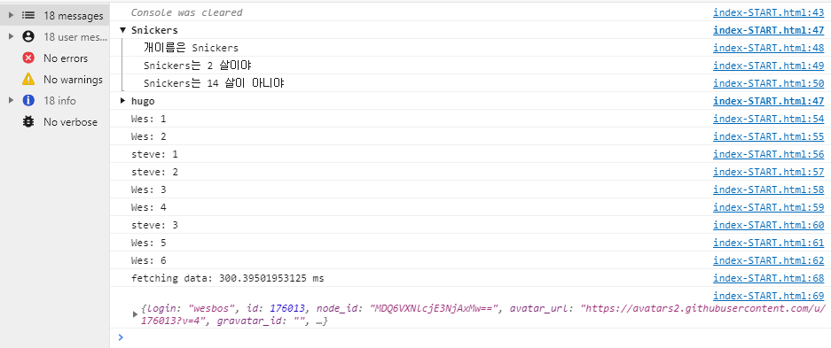
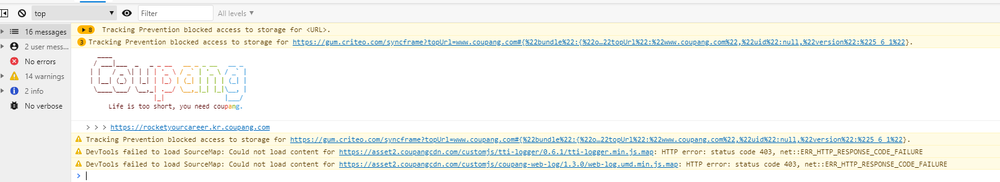
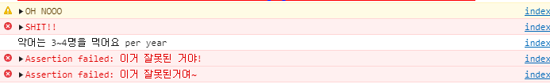
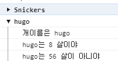

# 9. Dev Tools Domination

- 2021 01 05
- 학습 : 브라우저 내의 dev tools를 배워보자



## 배운점

### 콘솔 내에서 CSS 먹이기

```javascript
console.log('%c I am some great text', 'font-size:50px; background:red; text-shadow: 10px 10px 0 blue')
```


ㅋㅋㅋ쿠팡좀 보세요. console 창에 



이런 재밌는 이스터에그를 숨겨놨어요ㅋㅋㅋ 야무지다 진짜로ㅋㅋ

### 알림? `warn`, `error`, `info`, `assert`

```javascript
onsole.warn('OH NOOO')
// Error :|
console.error('SHIT!!')
// Info
console.info('악어는 3~4명을 먹어요 per year')
// Testing
/// 먼가 테스팅하고 시을땡
console.assert(1===2,'이거 잘못된 거야!');
const p = document.querySelector('p');
console.assert(p.classList.contains('ouch!'),'이거 잘못된거여~');
```



### `group` : 그룹만들기

```javascript
const dogs = [{ name: 'Snickers', age: 2 }, { name: 'hugo', age: 8 }];
dogs.forEach(dog => {
// console.group(`${dog.name}`);
  console.groupCollapsed(`${dog.name}`);
  console.log(`개이름은 ${dog.name}`);
  console.log(`${dog.name}는 ${dog.age} 살이야`);
  console.log(`${dog.name}는 ${dog.age*7} 살이 아니야`);
  console.groupEnd(`${dog.name}`);
})
```



- `.group`은 토글이 열려있고 `.groupCollapsed`는 토글이 닫아져있다

### `count`: 같은 데이터 개수 세기

```javascript
console.count('Wes');
console.count('Wes');
console.count('steve');
console.count('steve');
console.count('Wes');
console.count('Wes');
console.count('steve');
console.count('Wes');
console.count('Wes');
```

### `time` : 시간 확인하기

```javascript
console.time('fetching data');
  fetch('https://api.github.com/users/wesbos')
    .then(data => data.json())
    .then(data => {
      console.timeEnd('fetching data');
      console.log(data);
    });
```

