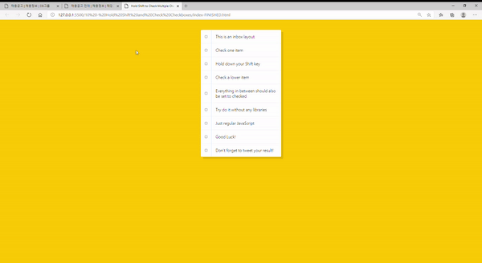

# 10.  Hold Shift and Check Checkboxes

- 2021 01 06
- 학습 : TodoList의 기본이 되는 체크박스 기능 + 변수 활용법



## 배운점

### `e.shiftKey`

쉬프트키 누르고 이벤트 실행시 -> True 를 리턴한다! 

그래서 이 기능은 시프트 누른 상태로 박스를 클릭하면 위 체크~아래체크 까지의 모든 범위를 체크하는데 활용된다.

### 체크박스 기능을 위한 변수 활용

```javascript
//1
const checkboxes = document.querySelectorAll('.inbox input[type="checkbox"]');

//3
let lastChecked;

function handleCheck(e) {
  
  //4
  let inBetween = false;
  
  //5  
  if (e.shiftKey && this.checked) {
    console.log('두번째')
    
    //6
    checkboxes.forEach(checkbox => {
      
      //7
      if (checkbox === this || checkbox === lastChecked) {
        inBetween = !inBetween;
        console.log('Starting to check them in between!');
      }

      //8
      if (inBetween) {
        checkbox.checked = true;
      }
    });
  }

  //9
  lastChecked = this;
}
//2
checkboxes.forEach(checkbox => checkbox.addEventListener('click', handleCheck));
```

1: 일단 체크박스를 다 가져오자

2: 가져온 체크박스들에 이벤트를 달아주자

3: 마지막-1번째에 체크된 태그를 변수에 담아두자

4:  마지막-1번째 ~마지막 체크한거 사이에 있는 지 확인하는 변수

5: 마지막 체크할 때 쉬프트 누르면서 체크했는가?

6~7: 그렇다면 모든 체크박스들이 루프를 돌면서 마지막-1번째 ~ 마지막 체크 사이에 있는 체크박스는 true로 바꿔주자 (inBetween)

8:  사이에 있는 체크박스 (inBetween===true) 들은 css 먹이자

### `checkbox.checked = true`

이건 체크박스 input에 체크가 되어있다 라는 의미 

- 
- 배운점
  - `e.shiftKey`
  - 체크박스 기능