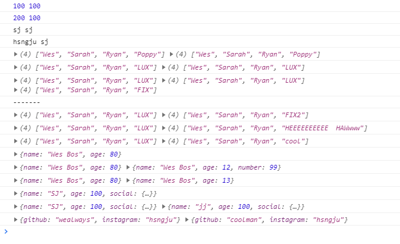

# 14. JavaScript References VS Copying

- 2021 01 13
- 학습 : 자바스크립트에서 참조와 복사의 차이를 알아봅시다



# 배운점

### 참조와 복사의 차이

1. num, string, bool 은 일반적으로 복사가 된다.

```javascript
let age = 100;
let age2 = age;
console.log(age,age2);
age = 200;
console.log (age,age2);

let name='sj';
let name2 = name;
console.log(name,name2) 
name = 'hsngju'
console.log(name,name2);
```

2. Array는 복사가 아니라 참조가 된다.

```javascript
const players = ['Wes', 'Sarah', 'Ryan', 'Poppy'];
const team = players;
console.log(players,team);
team[3]='LUX';
console.log(players,team);
```

3. 참조가 아니라 복사를 하고 싶다면?

```javascript
const team3 = [].concat(players);
const team4 = [...players];
const team5 = Array.from(players)
```

4. 객체도 복사하려면?

```javascript
const person = {
  name: 'Wes Bos',
  age: 80
};

const cap2 = Object.assign({},person,{number:99,age:12});
const cap3 = {...person,age:13};
```

5. 그런데 사실 이런 방법은 한 수준의 깊이밖에 복사가 되지 않아. 더 깊은 복사를 하고 싶다면...?

```javascript
const sj = {
  name:'SJ',
  age:100,
  social: {
    github:'wealways',
    instagram:'hsngju'
  }
}

const jj2 = JSON.parse(JSON.stringify(sj))
```


