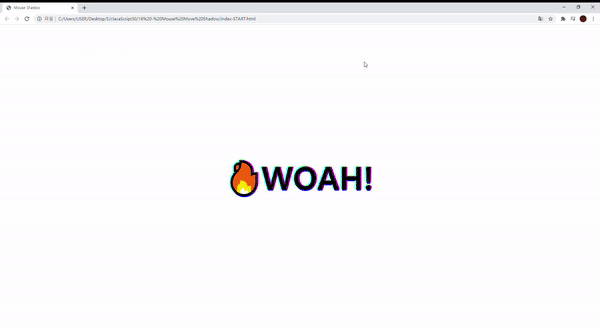

# 16. Mouse Move Shadow

- 2021 01 14
- 학습 : 브라우저 내의 마우스 위치를 파악해서 shadow를 해봅시다



## 배운점

### offsetWidth, offsetHeight

브라우저 안에서의 태그가 차지하는 크기


### offsetX, offsetY

브라우저 내에서의 크기!

### 변수할당하는법

```javascript
console.log(hero)
// {offsetWidth:16,offsetHeight:20}
const {offsetWidth:x, offsetHeight:y} = hero;
```

이런식을 할당 가능

