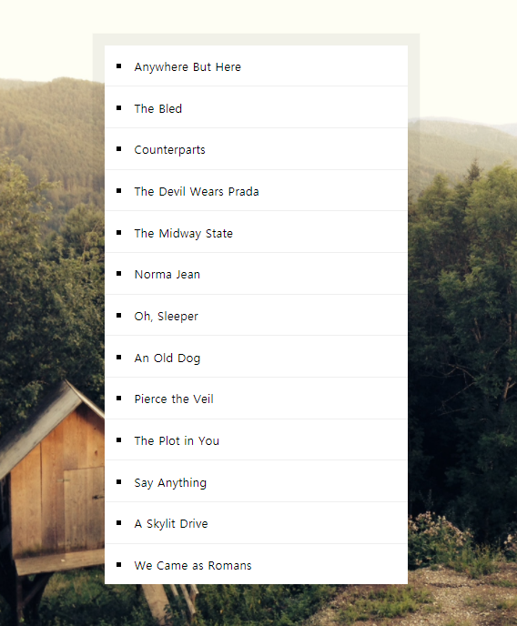

# 17 . Sort Without Articles

- 2021 01 15
- 학습 : 조사없애고 정렬하기



## 배운점

### 정규표현식 사용하는 법!

정규 표현식은 크게

1. 문자검색
2. 문자 대체
3. 문자 추출

로 이루어져있다.

정규표현식을 만드는 방법은 또한 

1. 리터럴 : `/`로 감싸주기

```javascript
re = /ab+c/;
```

2. 생성자 함수 : `new RegExp();`

```javascript
re = new RegExp("ab+c");
```

[특수문자 사용하기](https://developer.mozilla.org/ko/docs/Web/JavaScript/Guide/%EC%A0%95%EA%B7%9C%EC%8B%9D#%ED%8A%B9%EC%88%98_%EB%AC%B8%EC%9E%90_%EC%82%AC%EC%9A%A9%ED%95%98%EA%B8%B0)

`/ab*c/` : *앞에 b가 있어요. 즉 b가 0개 이상일 경우를 모두 패턴으로 잡습니다.

`/a\*/` : 백슬래쉬는 특수문자로 인정하지 않는 다는 말입니다.

`/^A/` : A로 시작하겠다

`/a+/`  : a가 1회 이상!

`/e?le?` : ?는 0 또는 1회. 따라서 'angle'의 le에 대응 / 'angel'의 el에 대응 / 'oslo'의 l에 대응 <- 왜냐면 e는 없어도 되니까 l만 남음

추가로 더 있는건 위에서 찾아보세요!

[괄호사용하기](https://developer.mozilla.org/ko/docs/Web/JavaScript/Guide/%EC%A0%95%EA%B7%9C%EC%8B%9D#%EA%B4%84%ED%98%B8%EB%A5%BC_%EC%82%AC%EC%9A%A9%ED%95%98%EA%B8%B0)

패턴을 기억하는 거에요.


-> 정규식은 보통 `match` `replace` `split` 메소드 등과 함께 쓰입니다.

[플래그를 사용한 고급검색](https://developer.mozilla.org/ko/docs/Web/JavaScript/Guide/%EC%A0%95%EA%B7%9C%EC%8B%9D#%ED%94%8C%EB%9E%98%EA%B7%B8%EB%A5%BC_%EC%82%AC%EC%9A%A9%ED%95%9C_%EA%B3%A0%EA%B8%89%EA%B2%80%EC%83%89)

`g` : 전역검색

`i` : 대소문자 구분없이 검색


💥 이번 공부에서 사용한 것!

```javascript
bandName.replace(/^(a |the |an )/i, '')
```

`a `,`the` , `an` 으로 시작하는 것 찾아서 공백으로 만들기! 그런데 `i`라는 플래그가 있잖아! 대소문자 구분없이 사용하자 라는 말!

### 정렬

로대쉬를 쓸 수도 있지만 바닐라로 정렬하는 법

오름차순

```javascript
ands.sort((a,b) => a > b ? 1: -1 );
```

