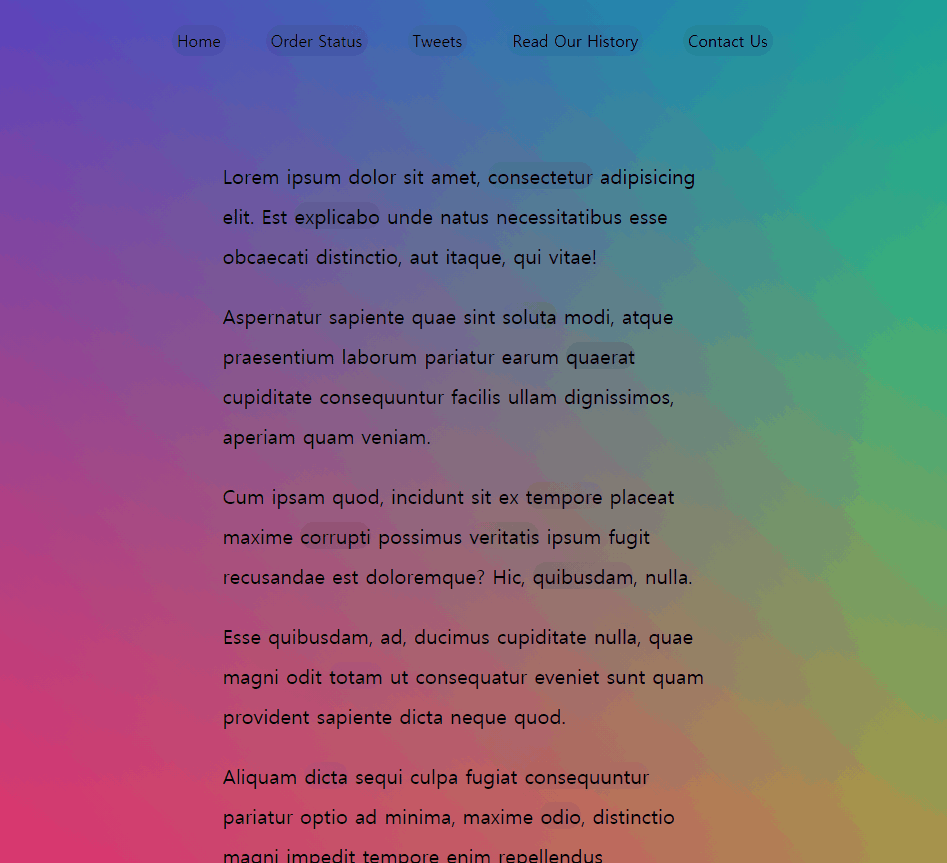

# 22. Follow Along Link Highlighter

- 2021 02 26

  

## 배운점

특정부분으로 부드럽게 hover 이벤트 만들기

### `getBoundingClientRect()` 메서드!!

```javascript
function highlightLink() {
      // getBoundingClientRect 메서드!!! 미쳤다!!!!
      const linkCoords = this.getBoundingClientRect();
      const coords = {
        width: linkCoords.width,
        height:linkCoords.height,
        top: linkCoords.top + window.scrollY,
        left:linkCoords.left + window.scrollX
      }
      highlight.style.width = `${coords.width}px`;
      highlight.style.height = `${coords.height}px`;
      highlight.style.transform = `translate(${coords.left}px,${coords.top}px)`
```

이 메서드 처음 알게 되었는데, 진짜 좋은거 같다. 선택한 요소의 각종 좌표값이 들어있는 객체를 반환해준다!! 

길이 높이 뿐만 아니라 Viewport의 시작지점을 기준으로 한 상대좌표 Y값도 알려준다!!

[MDN](https://developer.mozilla.org/en-US/docs/Web/API/Element/getBoundingClientRect)


### `window.scrollY`

이번 과제에서는 스크롤내려도 잘 동작하게 하기 위해서 스크롤한 만큼을 `getBoudingClientRect` 결과값에 더해줘야한다!


### CSS : `z-index`, `transition`

```css
.highlight {
  transition: all 0.2s;
  border-bottom: 2px solid white;
  position: absolute;
  top: 0;
  background: white;
  left: 0;
  z-index: -1;
  border-radius: 20px;
  display: block;
  box-shadow: 0 0 10px rgba(0,0,0,0.2);
}
```

`transition` 을 통해 자연스럽게 요소의 크기에 맞게 변화하는 highlight!!

`z-index:-1` 인 이유는 글 아래에 깔려야 하니까!!

