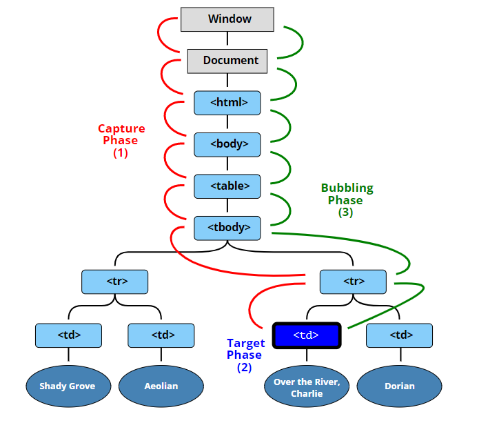

# 25. Event Capture, Propagation, Bubbling and Once

- 2021 03 01
- `event`의 여러 property를 공부해보자


## 배운점

Event가 DOM에서 실행되는 단계입니다.



1) 캡처 : 이벤트가 상위 ➡ 하위 요소로 전달되는 걸 캡쳐하기

2) Target : 이벤트가 실제 타깃 요소에 전달!

3) bubbling : 이벤트가 상위 요소로 전파되는 단계


### bubbling

```html
<div class="one">
    <div class="two">
        <div class="three">
        </div>
    </div>
</div>
```

```javascript
const divs = document.querySelectorAll('div');
function logText(e) {
    console.log(this.classList.value)
  }

  divs.forEach(div=> div.addEventListener('click',logText));
```

class 3 클릭시 3➡2➡1 로 이벤트가 전파되면서 three,two,once이 출력된다.

### bubbling 막기

```javascript
const divs = document.querySelectorAll('div');
function logText(e) {
    console.log(this.classList.value)
    e.stopPropagtion();
  }

  divs.forEach(div=> div.addEventListener('click',logText));
```

`e.stopPropagtion()` 을 통해 버블링이 막힌다.

### caputre, once

```javascript
  divs.forEach(div=> div.addEventListener('click',logText,{
    capture:true,
    once:true,
  }));
```

`capture:true` 일 경우, 캡처단계가 되면서 up ➡ down 으로 출력이 진행된다.

`once:true`:  이벤트를 한번만 실행하고, 그 이벤트가 삭제됩니다. 💥 한번만 이벤트를 발생시키고 싶을 때, 예를들어 결제 버튼같은 경우 이를 활용할 수 있습니다.

