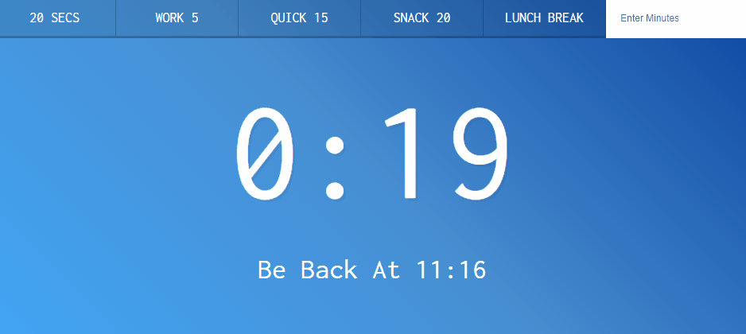

# 29. Countdown Timer

- 2021 03 08
- 카운트다운 타이머 만들기



## 배운것

```javascript
let countdown;
const timerDisplay = document.querySelector('.display__time-left');
const endTime = document.querySelector('.display__end-time');
const buttons = document.querySelectorAll('[data-time]');

function startTimer() {
  const seconds = parseInt(this.dataset.time);
  timer(seconds);
}

buttons.forEach(button => button.addEventListener('click', startTimer));
document.customForm.addEventListener('submit', function(e) {
  e.preventDefault();
  const mins = this.minutes.value;
  console.log(mins);
  timer(mins * 60);
  this.reset();
});
```


 ### 타이머

```javascript
function timer(seconds) {
  // clear any existing timers
  clearInterval(countdown);

  const now = Date.now();
  const then = now + seconds * 1000;
  displayTimeLeft(seconds);
  displayEndTime(then);

  countdown = setInterval(() => {
    const secondsLeft = Math.round((then - Date.now()) / 1000);
    // check if we should stop it!
    if(secondsLeft < 0) {
      clearInterval(countdown);
      return;
    }
    // display it
    displayTimeLeft(secondsLeft);
  }, 1000);
}
```

처음에 시간을 받아오고 나서 그걸 보여줌, 남은 시간도 보여줌

그리고 1초씩 시간이 줄어들겠지? 그걸 또 보여줌.


### `clearInterval`, `parseInt`

claerInterval : 진행중인 setInterval()를 멈추게 하는 것

parseInt : 문자열을 정수로 만들기


### HTML form 접근법

```html
<form name="customForm" id="custom">
    <input type="text" name="minutes" placeholder="Enter Minutes">
</form>
```

```javascript
document.customForm.addEventListener('submit', function(e) {
  e.preventDefault();
  const mins = this.minutes.value;
  console.log(mins);
  timer(mins * 60);
  this.reset();
});
```

document.`customForm` 이렇게 접근 가능

그리고 this.`monutes` 이렇게 name으로 접근!