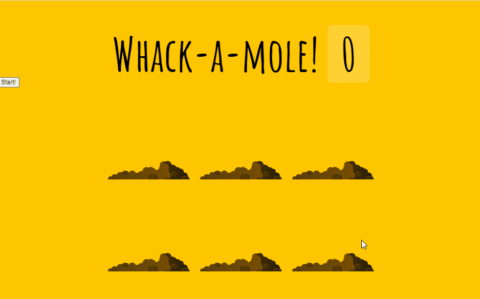

# 30. Whack A Mole

- 2021 03 10
- 두더지게임



## 배운점

- 모듈화가 잘 되어 있네요.

```javascript
// 두더지 올라오는 시간 랜덤하게  
function randTime(min,max){
    return Math.round(Math.random() * (max-min) +min)
  }

// 두더지 어느 구멍에서 올라오는 지 랜덤하게
function randHole(holes) {
    const idx = Math.floor(Math.random() * holes.length);
    const hole = holes[idx];
    if(hole===lastHole) {
      console.log('같은 홀입니다...')
      return randHole(holes);
    }
    lastHole = hole;
    return hole
  }

// 위의 두 함수를 활용해서, 실제로 CSS이용해서 두더지 올라오게 만들기
function peep() {
    const time = randTime(200,1000)
    const hole = randHole(holes);
    hole.classList.add('up')
    setTimeout(()=>{
      hole.classList.remove('up')
      // 게임 계속하게 하기
      if(!timeUp) peep();
    },time);
    console.log(time,hole)
  }

// 두더지 올라오기 10초간 진행하는 게임 시작 트리거
function startGame() {
    scoreBoard.textContent = 0;
    timeUp = false;
    score = 0;
    peep();
    setTimeout(()=>timeUp=true,10000)
  }

// 뽕망치 기능 함수
function bonk(e) {
    if(!e.isTrusted) return;
    score++;
    this.classList.remove('up')
    scoreBoard.textContent = score;
  }
```

