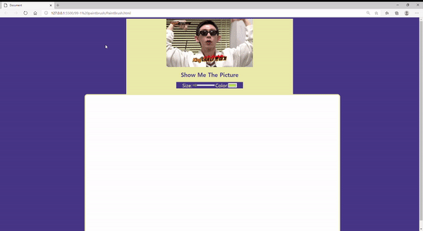

# 99 - 1 PaintBruch

- 2021 01 04
- 학습 : 3강 + 8강 배운거 토대로 나만의 그림판 만들어보기




## 복습

### canvas

`canvas` 태그 필수!

`const ctx = canvas.getContext('2d');` 를 통해 그림그릴 수 있게 만들어주기!

`draw()` function 만들기!

- `strokeStyle`, `lineWidth`, `lineJoin`, `lineCap` 변수 할당하자!
- `beginPath()`, `moveTo(x,y)`, `lineTo()`, `stroke()` 필수!

### html Input data 사용하기


## 배운 것

### [lodash](https://lodash.com/) 라이브러리

> JavaScript 라이브러리 중 가장 활용많이 되고 유명한거

그 중에서 저는 랜덤값 만들기 메서드를 사용했습니다.

```javascript
// 짤 랜덤
const zzal = document.querySelector('.zzal > img');
zzal.src = _.sampleSize(['king.gif','achoo.gif','miran.gif'],1)
```

### `resize`, `onclick` 이벤트 종류 확인

- resize : 사이즈가 변하면 이벤트 실행

```javascript
//반응형
canvas.width = window.innerWidth * 0.6;
function changeSize() {
  canvas.width = window.innerWidth * 0.6
  console.log('hi')
}

window.addEventListener('resize',changeSize);
```

- onclick : 클릭시 이벤트 실행

```
<div class="zzal" onClick="window.location.reload()">
    
</div>
```

