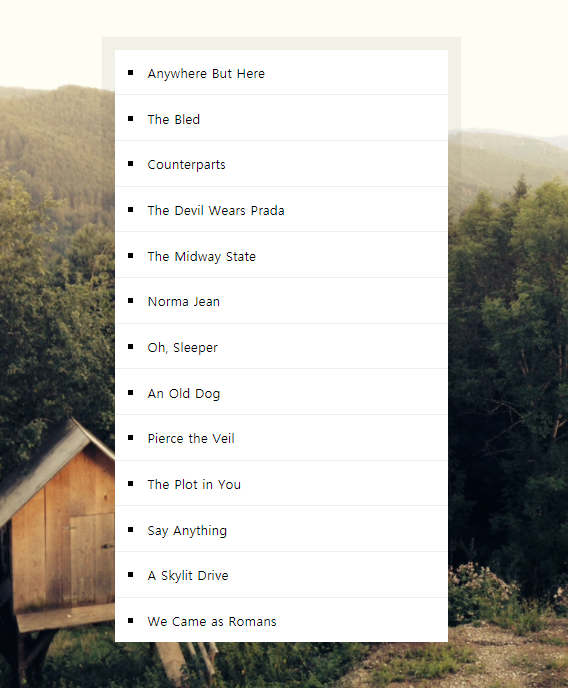
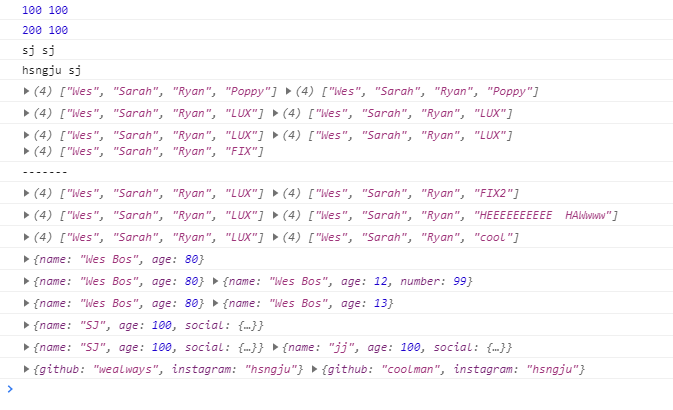
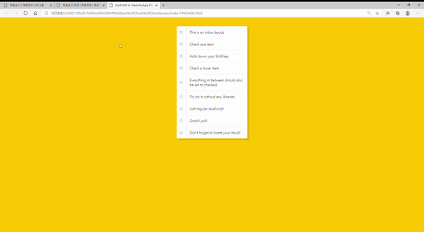
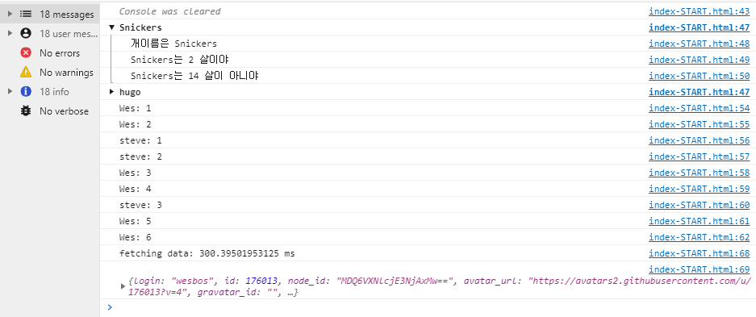
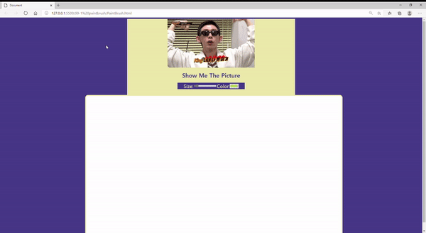

# JavaScript30

> JavaScript30 챌린지! 

https://github.com/wesbos/JavaScript30 

땡스🙏🙏  덕분에 자바스크립트와 css 어떻게 써야할 지 공부하는 계기가 되었고, (아직 1일차 끝났지만, 벌써 도우밍 되는 걸 느껴!)

각각의 day 폴더에 들어가면, 보다 자세히 어떤걸 익혔는 지 적어놨습니다! 

복습할 때 참고하자 :)

 

## 후기

> 210310

자바스크립트, css, html 문법만 대충 안 상태에서 시작한 챌린지였습니다. 20년 12월 19일에 처음 시작했었네요. 중간에 바쁜일도 있었고, 그래서 30일 챌린지가 되진 않았지만 배운 건 정말 많았습니다.

특히 JS에서 여러 웹 api가 있다라는것. 그리고 어떨때 헬퍼메서드를 써야할 지.뿐만 아니라 이를 css와 어떻게 연관 지을 지 큰 도움이 되었네요.

중간중간에 몇가지 프로젝트를 하면서 bootstrap, vuetify를 쓰다보니 직접 modal이나 드롭다운 등을 구현하지 않았고 그 원리를 몰랐는데, 여기서 또 배웠어요.  바닐라 JS가 중요하다고 생각하는데, 그 기초를 연마?한 거 같아서 개인적으로 정말 만족한 챌린지였습니다! 

앗 그리고 [Velog](https://velog.io/@hsngju)에서 복습겸 포스팅을 다시 하려고 합니다 :) 

 

 

## 30. Whack A Mole

- 2021 03 10
- 두더지게임

- 배운점
  - 모듈화가 잘 되어 있네요.

 

## 29. Countdown Timer

- 2021 03 08
- 카운트다운 타이머 만들기

- 배운것
  - 타이머 만들기
  - `clearInterval`, `parseInt`
  - HTML의 form 접근법

 

## 28. video Speed Controller

- 2021 03 07
- 비디오 속도 조절기능

- 배운점
  - 속도조절기능만들기
  - `toFixed()` : 고정소수점 표기법으로 만들기

 

## 27. Click and Drag

- 2021 03 06
- slider 만들기

- 배운것
  - slide 스크롤 만들기 CSS 
    - `white-space:nowrap`, `overflow`, `user-select`
  - slide 스크롤 만들기 JS

 

## 26. Stripe Follow Along Nav

- 2021 03 02
- nav에서 dropdown 만들기!!

- 배운것

  - `getBoundingClientRect` 복습 : 요소의 위치 크기 등을 알려주는 메서드
  - 익명함수의 특징
  - css : `opacity` 특징/ `hover`에 이벤트 주기 위해 해야할 것.

  

 

## 25. Event Capture, Propagation, Bubbling and Once

- 2021 03 01
- `event`의 여러 property를 공부해보자

- 배운점
  - Capture, Propagation, Bubbling and Once
  - 💥 Once 언제 쓸까?

 

## 24. Sticky Nav

- 2021 02 28
- 고정 Nav 만들기

- 배운점
  - 고정 nav 만들기!
  - 안보이던 로고 보이게 하기

 

## 23. Speech Synthesis

- 2021 02 27
- 자바스크립트의 TTS 기능 활용하기!

- 배운점
  - `SpeechSynthesisUtterance` api 활용법
  - stop! speak! 설정하는 flag를 함수로 만들었다!!
  - `map`, `find` , `forEach` 메서드 복습 또 복습!

 

## 22. Follow Along Link Highlighter

- 2021 02 26
- 특정부분으로 부드럽게 hover 이벤트 만들기

- 배운점
  - `getBoundingClientRect()` 메서드 !!
  - `window.scrollY`스크롤 얼마나 내렸는 지 확인하는 거 필수 !!
  - css 기능 : `z-index`, `transition` 

 

## 21. Speech Detection

- 2021 02 25
- 자바스크립트 geolocation 활용하기

- 배운점
  - `navigator.geolocation` 사용법

 

## 20. Speech Detection

- 2021 01 18
- 학습 : speech detection 사용하기

- 배운점
  - window.SpeechRecognition 객체 사용하기

 

## 19. Webcam Fun

- 2021 02 25
- 웹캠 활용하기

- 웹캠 사용하기
- 움짤 No dab;;

 

## 18. Adding Up times with Reduce

- 2021 01 16
- 학습: 전체 비디오 시간을 합산하여, 시분초로 표시 !

- 배운점
  - 다큐먼트에서 찍먹해오는 건 nodelist입니다. 그래서 `map` 메서드를 사용할 수 없어요/
  - `parseFloat(str)` : 스트링 숫자를 진짜 숫자로 바꿔줘요.
  - `.reduce` : reduce는 줄이다는 말이죠. 배열의 값들을 하나의 값으로 만들어요 (줄여요)
  - `Math.floor()` : 버림

 

## 17 . Sort Without Articles

- 2021 01 15
- 학습 : 조사없애고 정렬하기

- 배운점
  - 정규 표현식 사용하는 방법!
  - 바닐라자바스크립트로 정렬하는거 복습!

 

## 16. Mouse Move Shadow

- 2021 01 14
- 학습 : 브라우저 내의 마우스 위치를 파악해서 shadow를 해봅시다

- 배운점

  - offsetWidth, offsetHeight
  - offsetX,offsetY
  - 변수 할당하는 법
    - const {offsetWidth:width, offsetHeight:height} = hero;

  

 

## 15. LocalStorage

- 2021 01 17
- 학습 : 투두리스트 만들기 + localstorage 사용하기

- 배운점
  - JSON.parse , JSON.stringify
  - localStorage 저장하기
  - e.preventDefault
  - formObject.reset()

 

## 14. JavaScript References VS Copying

- 2021 01 13
- 학습 : 자바스크립트에서 참조와 복사의 차이를 알아봅시다

- 배운점
  - 참조와 복사의 차이
  - 배열 또는 객체를 깊은복사를 하고 싶다면...?
    - [...array], {...object} -> JSON.parse(JSON.stringify(object))

 

## 13. Slide in on Scroll

- 2021 01 12
- 학습: 스크롤 내리는 걸 감지는 마법!

- 배운점
  - debounce 함수!!
  - 스크롤 내리는 거 감지하기!
    - window.scrollY vs window.innerHeight
    - image.offsetTop
  - css -> box-sizing:inherit

 

## 12. Key Sequence Detection

- 2021 01 11
- 학습: key sequence를 추적하는 법을 배워봐요!
- 배운점
  - splice()

 

## 11. Custom Video Player

- 2021 01 10
- 학습 : 커스텀 비디오 플레이어를 만들어 봐요!

- 배운점
  - video 태그 컨트롤 하는 법

 

## 10.  Hold Shift and Check Checkboxes

- 2021 01 06
- 학습 : TodoList의 기본이 되는 체크박스 기능 + 변수 활용법

- 배운점
  - `e.shiftKey`
  - 체크박스 기능
  - `checkbox.checked = true`

 

## 9. Dev Tools Domination

- 2021 01 05
- 학습 : 브라우저 내의 dev tools를 배워보자

- 배운점
  - 콘솔 내에서 css 먹이기
  - 알림? `warn`, `error`, `info`, `assert`
  - `group` : 그룹만들기
  - `count`: 같은 데이터 개수 세기
  - `time` : 시간 확인하기

 

## 99-1 PaintBruch

- 2021 01 04
- 학습 : 3강 + 8강 배운거 토대로 나만의 그림판 만들어보기

- 복습
  - `canvas` 
  - html에서 Input 받아와서 처리하기
- 새로 활용한거
  - lodash 라이브러리
  - `resize`, `onclick` 이벤트 종류 확인

 

## 8. Fun with HTML5 Canvas

- 2021 01 03
- 학습 : 캔버스 활용법

- 배운점
  - `canvas` 활용법
  - `mousedown`, `mousemove`, `mouseup`, `mouseout` 이벤트 종류 확인

 

## 7. Array Cardio 2

- 2021 01 02
- 학습 : 배열 처리 메서드
- 배운점
  - `array.prototype.some()` , `array.prototype.every()`
  - `array.prototype.find()`, `array.prototype.findIndex()`
  - 배열 삭제하는 법

 

## 6. Type Ahead

- 2020 12 30
- 학습 : 검색어 바로 보여주는 기능

- 배운점
  - fetch().then
  - 정규표현식사용하여 filter
  - `...` 기능 : 비구조화 할당 문법
  - 숫자 세자리마다 컴마(,) 찍기

 

## 5. Flex Panel Gallery

- 2020 12 28
- 학습 : flex 화면 애니메이션!
- 배운점
  - `flex` 균등하게 분배하기
  - `transform: translate`
  - `transitionend` 이벤트 복습

 

## 4. Array Cardio

- 2020 12 24

- 학습 : JS에서 Array 관련 메서드!

- 배운점

  - `.filter()`
  - `.map()`
  - `sort()`
  - `.reduce()`

 

## 3. CSS Variables

- 2020 12 22
- 학습 : CSS의 변수를 활용해서 css 업데이트하기
- 배운점
  - `:root { -- variable}` 
  - `dataset` 활용
  - `||` & `setProperty()` 
  - `change`, `mousemove` 이벤트

 

## 2. JS and CSS Clock

- 2020 12 21

- 학습 : 시계만들기!
- 배운점
  - `Date` 객체
  - `transform`, `transition` 등 CSS속성 및 사용법
- `setInterval` : JS 함수 사용

 

## 1. JavaScript Drum Kit 

- 2020 12 19

- 학습 : 키보드 눌렀을 때(`keydown`) 드럼 소리가 나오는 이벤트 만들기!	

- 배운점
  - `태그[속성=" "]` 활용방법
  - `transform` , `transition`  등 CSS속성 사용법
  - `transitionend` 이벤트 특징
